# 💻 Portfólio - Desenvolvedor Full Stack Júnior

<div align="center">
  
  
  **Rennifer Teixeira**  
  *Desenvolvedor Full Stack Júnior | JavaScript | React | Node.js*
</div>

---

Bem-vindo ao meu portfólio! Aqui você encontrará uma coleção de projetos que demonstram minha experiência em desenvolvimento Full Stack, com foco em **JavaScript, TypeScript, React.js, Next.js e Node.js**.

---

## 📱 Apresentação do Portfólio

### **Portfólio Responsivo - Modo Claro e Escuro**
O portfólio foi desenvolvido com suporte a temas claro e escuro, proporcionando uma experiência visual agradável em qualquer dispositivo:

<div align="center">
  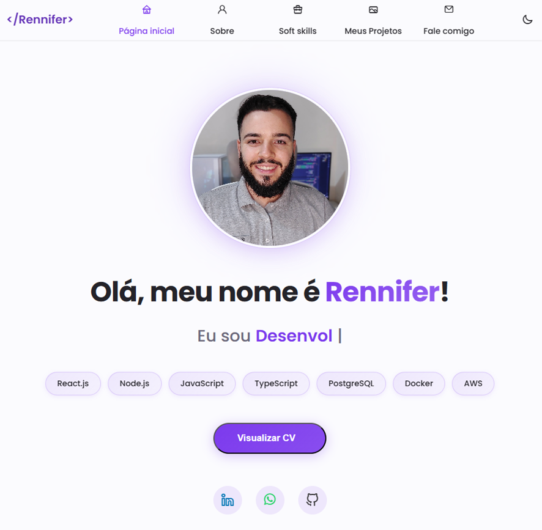
  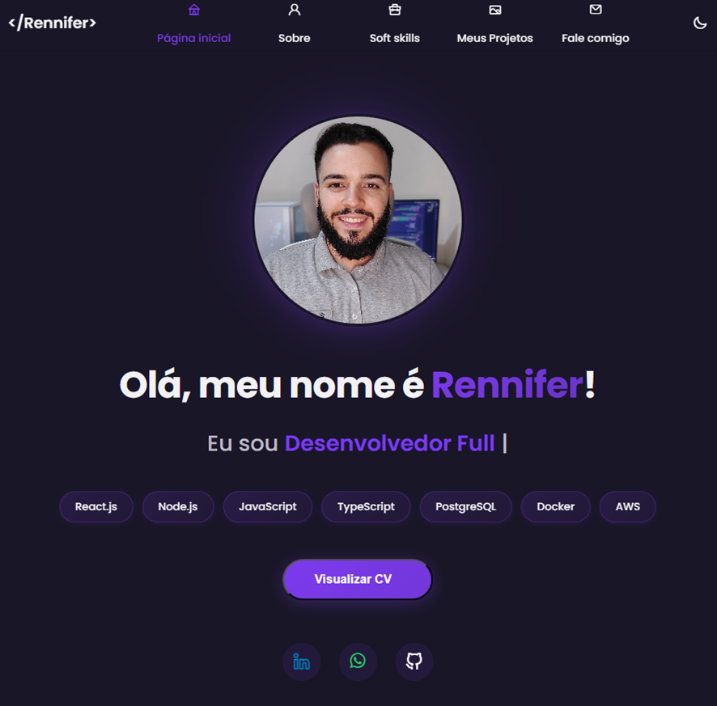
</div>

### **Currículo**
Meu currículo profissional está disponível em formato visual e pode ser visualizado em um modal interativo. Você também tem a opção de fazer o download do arquivo PDF:

<div align="center">
  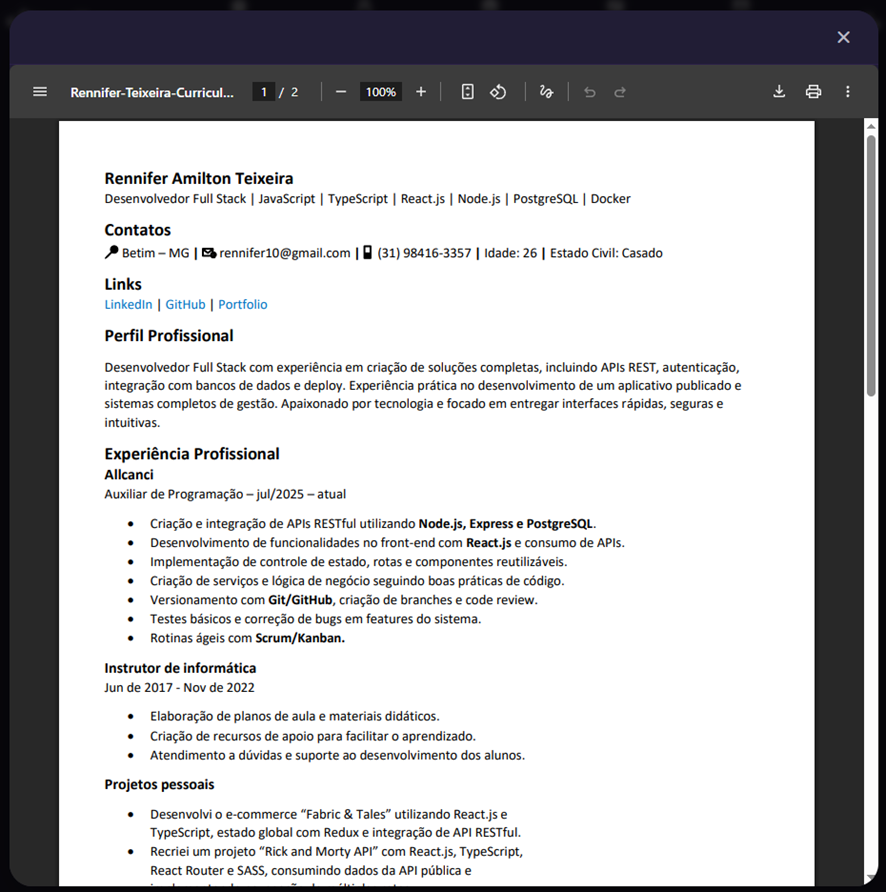
</div>

**💡 Funcionalidade**: Clique no botão "Visualizar CV" para abrir o currículo em um modal. Se desejar, você pode fazer o download do arquivo PDF diretamente.

### **Sobre Mim**
Conheça mais sobre minha trajetória e experiência como desenvolvedor:

<div align="center">
  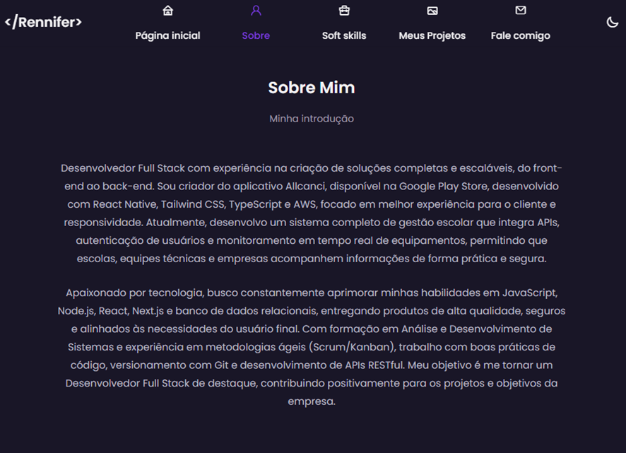
</div>

### **API de Email**
Implementei uma API robusta para envio de emails através do formulário de contato. O sistema utiliza **Nodemailer** para garantir entrega confiável e segura de mensagens:

<div align="center">
  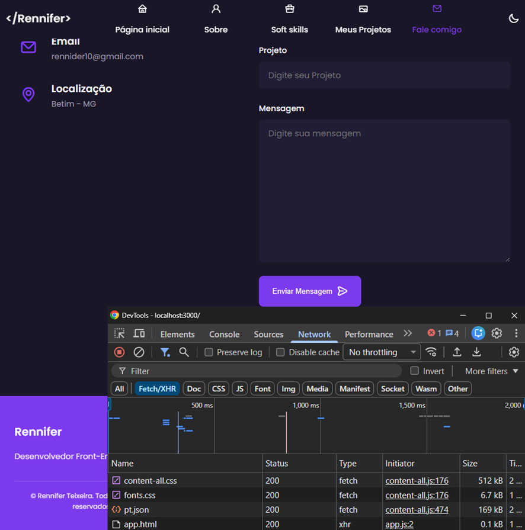
</div>

**🔧 Detalhes Técnicos**:
- Backend em **Node.js/Express**
- Integração com **Gmail** via Nodemailer
- Validação de dados no cliente e servidor
- Tratamento de erros robusto
- Variáveis de ambiente para segurança

---

## 👋 Sobre Mim

Sou um **Desenvolvedor Full Stack Júnior** apaixonado por criar soluções web modernas, escaláveis e com excelente experiência do usuário. Tenho experiência prática em:

- ✅ Desenvolvimento de aplicações web responsivas e acessíveis, bem como aplicativos nativos para iOS e Android, seguindo boas práticas de UI/UX e performance
- ✅ Integração de APIs REST e comunicação front-end/back-end
- ✅ Implementação de boas práticas de código e arquitetura
- ✅ Versionamento com Git e organização de projetos
- ✅ Deploy e otimização de aplicações em produção

Meu objetivo é contribuir para equipes de desenvolvimento, aprender continuamente e entregar código de qualidade que agregue valor aos projetos.

---

## ���️ Tecnologias & Ferramentas

### **Front-end**
- **React.js** - Componentes reutilizáveis e gerenciamento de estado
- **JavaScript/TypeScript** - Lógica robusta e tipagem segura
- **Styled Components** - CSS-in-JS para estilos dinâmicos e escaláveis
- **Swiper.js** - Carrosséis e sliders interativos
- **Typed.js** - Efeitos de digitação e animações de texto
- **HTML5 & CSS3** - Semântica e responsividade

### **Back-end**
- **Node.js** - Runtime JavaScript para servidor
- **Express.js** - Framework web minimalista e flexível
- **Nodemailer** - Integração de envio de emails
- **CORS** - Gerenciamento de requisições cross-origin
- **Dotenv** - Variáveis de ambiente seguras

### **Ferramentas & Plataforma**
- **Git & GitHub** - Controle de versão e repositório
- **Vercel** - Deploy de front-end e back-end serverless
- **npm** - Gerenciador de pacotes
- **VS Code** - Editor de código

---

## 🏗️ Arquitetura & Organização do Projeto

O projeto segue uma estrutura **modular e escalável**, separando claramente as responsabilidades entre front-end e back-end:

```
portifolio-renniferdev/
├── frontend/                    # Aplicação React
│   ├── public/
│   │   └── img/                # Imagens e assets do portfólio
│   ├─��� src/
│   │   ├── components/         # Componentes reutilizáveis
│   │   │   ├── Header.js       # Navegação principal
│   │   │   ├── Home.js         # Seção inicial
│   ���   │   ├── About.js        # Sobre mim
│   │   │   ├── Skills.js       # Habilidades técnicas
│   │   │   ├── Portfolio.js    # Galeria de projetos
│   │   │   ├── Contact.js      # Formulário de contato
│   │   │   ├── Modal.js        # Modal reutilizável
│   │   │   ├── CVModal.js      # Modal para CV
│   │   │   ├── Footer.js       # Rodapé
│   │   │   ├── ScrollUp.js     # Botão scroll to top
│   │   │   └── ColorPalette.js # Seletor de tema
│   │   ├── config/             # Configurações
│   │   ├── App.js              # Componente raiz
│   │   ├── index.js            # Ponto de entrada
│   │   ├── index.css           # Estilos globais
│   │   └── setupProxy.js       # Proxy para API
│   ├── package.json
│   └── .env.local.example      # Variáveis de ambiente
│
├── backend/                     # API Node.js/Express
│   ├── api/
│   │   ├── index.js            # Configuração principal
│   │   ├── health.js           # Health check
│   │   ├── send-email.js       # Lógica de email
│   │   └── debug.js            # Utilitários de debug
│   ├── index.js                # Ponto de entrada
│   ├── server.js               # Servidor Express
│   ├── package.json
│   ├── .env.example            # Variáveis de ambiente
│   └── vercel.json             # Configuração Vercel
│
└── README.md                    # Este arquivo
```

### **Princípios de Organização**

- **Separação de Responsabilidades**: Front-end e back-end em diretórios distintos
- **Componentização**: Componentes React pequenos, focados e reutilizáveis
- **Configuração Centralizada**: Variáveis de ambiente em `.env`
- **Escalabilidade**: Estrutura preparada para crescimento

---

## 🎯 Técnicas & Boas Práticas Aplicadas

### **1. Componentização**
Componentes React bem estruturados e reutilizáveis, cada um com responsabilidade única:
- Componentes funcionais com hooks
- Props tipadas e validadas
- Separação clara entre componentes de apresentação e lógica

### **2. Clean Code**
- Nomes descritivos para variáveis, funções e componentes
- Funções pequenas e focadas em uma única responsabilidade
- Comentários apenas quando necessário
- Código legível e fácil de manter

### **3. Responsividade**
- Design mobile-first
- Media queries para diferentes breakpoints
- Componentes adaptáveis a qualquer tamanho de tela
- Testes em múltiplos dispositivos

### **4. Acessibilidade (A11y)**
- Semântica HTML correta
- Atributos ARIA quando necessário
- Contraste adequado de cores
- Navegação por teclado funcional
- Suporte a leitores de tela

### **5. Integração com APIs**
- Comunicação REST entre front-end e back-end
- Tratamento de erros robusto
- Validação de dados no cliente e servidor
- Proxy configurado para desenvolvimento local

### **6. Separação de Responsabilidades**
- **Front-end**: Interface, interação do usuário, validação de entrada
- **Back-end**: Lógica de negócio, segurança, integração com serviços externos
- **Variáveis de Ambiente**: Dados sensíveis protegidos

### **7. Segurança**
- Variáveis de ambiente para dados sensíveis (chaves de API, credenciais)
- CORS configurado adequadamente
- Validação de entrada no servidor
- Proteção contra requisições malformadas

### **8. Versionamento com Git**
- Commits descritivos e atômicos
- Branches para features e fixes
- `.gitignore` configurado para excluir arquivos sensíveis
- Histórico claro e rastreável

---

## 📋 Processo de Desenvolvimento

### **Fase 1: Planejamento**
- Definição de requisitos e escopo
- Prototipagem e wireframes
- Planejamento da arquitetura

### **Fase 2: Desenvolvimento Front-end**
- Criação de componentes React
- Implementação de estilos com Styled Components
- Integração com APIs
- Testes de responsividade

### **Fase 3: Desenvolvimento Back-end**
- Criação de endpoints REST
- Implementação de lógica de negócio
- Integração com serviços externos (ex: Nodemailer)
- Validação e tratamento de erros

### **Fase 4: Integração**
- Conexão front-end com back-end
- Testes de fluxo completo
- Ajustes e otimizações

### **Fase 5: Deploy**
- Configuração de variáveis de ambiente
- Deploy no Vercel
- Testes em produção
- Monitoramento e manutenção

---

## 📸 Galeria do Projeto

Abaixo estão imagens que demonstram a estrutura e interface do portfólio:

### **Estrutura de Pastas**
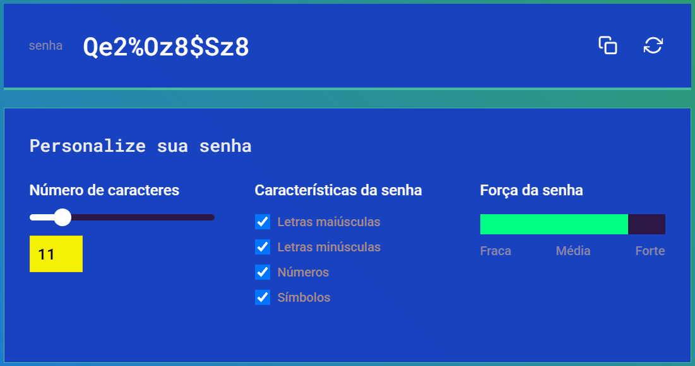

### **Tecnologias Utilizadas**
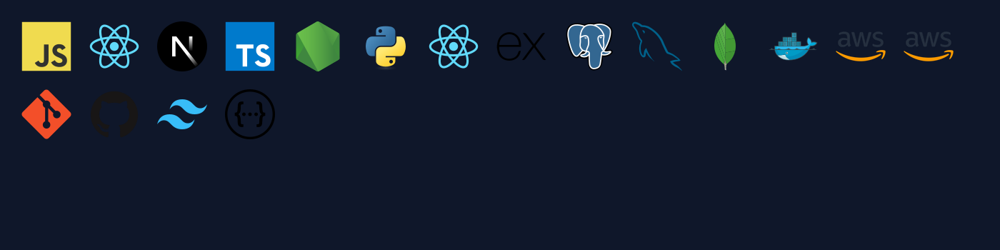

### **Projetos em Destaque**

#### Projeto 1: AllCanci
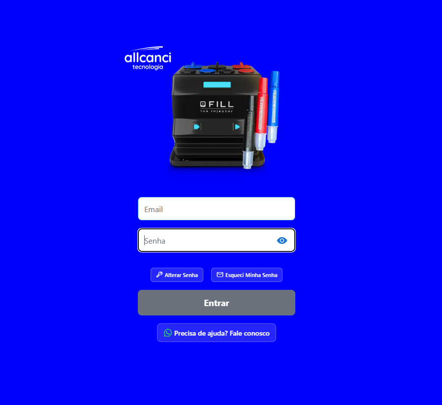
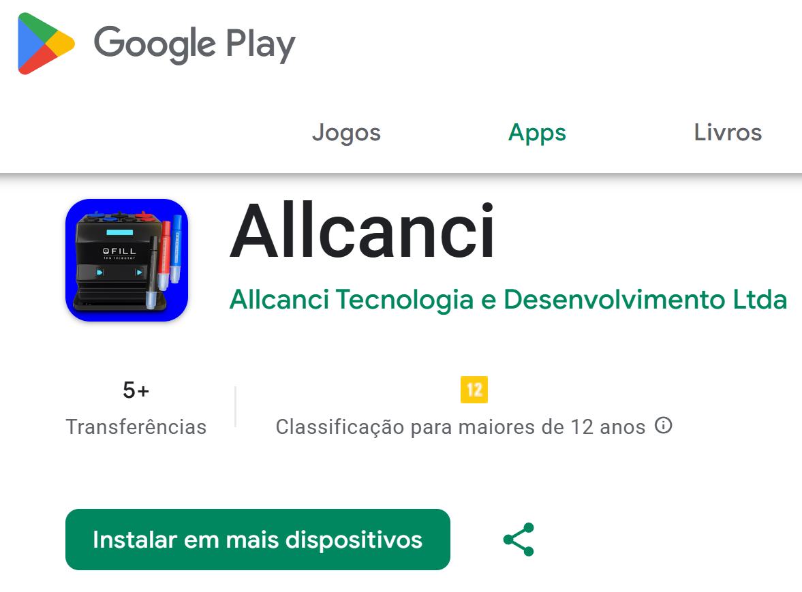

#### Projeto 2: Barbearia


#### Projeto 3: Fabric & Tales
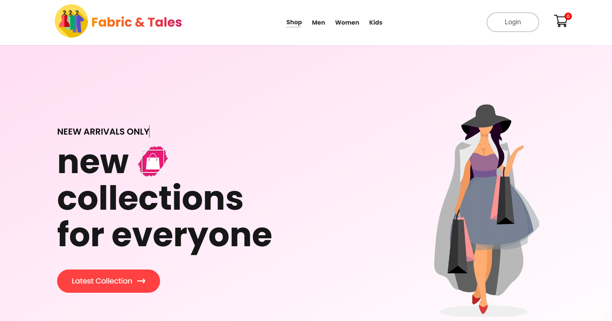

#### Projeto 4: Quiz


#### Projeto 5: Busca de CEP
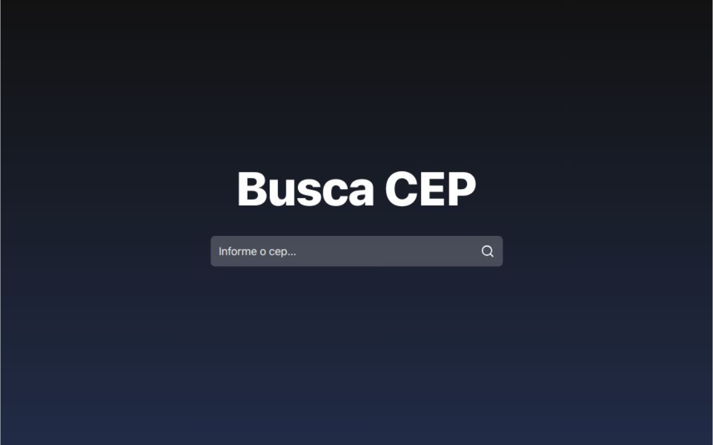

---

## 🚀 Como Rodar o Projeto Localmente

### **Pré-requisitos**
- Node.js (v14 ou superior)
- npm ou yarn
- Git

### **Passo 1: Clonar o Repositório**
```bash
git clone https://github.com/seu-usuario/portifolio-renniferdev.git
cd portifolio-renniferdev
```

### **Passo 2: Configurar o Front-end**
```bash
cd frontend
npm install
cp .env.local.example .env.local
npm start
```

O front-end estará disponível em `http://localhost:3000`

### **Passo 3: Configurar o Back-end**
Em outro terminal:
```bash
cd backend
npm install
cp .env.example .env
```

Edite o arquivo `.env` com suas credenciais:
```env
GMAIL_USER=seu-email@gmail.com
GMAIL_PASSWORD=sua-senha-app
GMAIL_FROM_NAME=Portfólio Rennifer
GMAIL_RECIPIENT_EMAIL=seu-email@gmail.com
```

Inicie o servidor:
```bash
npm start
```

O back-end estará disponível em `http://localhost:5000`

### **Passo 4: Testar a Integração**
- Acesse `http://localhost:3000`
- Preencha o formulário de contato
- Verifique se o email foi recebido

---

## 🔗 Links Importantes

- **🌐 Portfólio Online**: [Visite meu portfólio](https://seu-dominio.com)
- **📂 Repositório GitHub**: [github.com/seu-usuario/portifolio-renniferdev](https://github.com/seu-usuario/portifolio-renniferdev)
- **💼 LinkedIn**: [linkedin.com/in/seu-perfil](https://linkedin.com/in/seu-perfil)
- **📧 Email**: rennifer10@gmail.com

---

## 💼 Para Recrutadores

Olá! Se você está aqui, é porque está buscando um desenvolvedor Full Stack comprometido com qualidade e aprendizado contínuo.

### **O que você encontrará neste portfólio:**

✨ **Código de Qualidade**: Projetos desenvolvidos seguindo boas práticas, padrões de design e princípios SOLID

🎯 **Experiência Prática**: Projetos reais que demonstram capacidade de resolver problemas e integrar tecnologias

📚 **Aprendizado Contínuo**: Demonstração de evolução técnica e disposição para aprender novas tecnologias

🚀 **Produção-Ready**: Aplicações deployadas e funcionando em produção

### **Minhas Qualidades:**

- Desenvolvedor proativo e autodidata
- Excelente comunicação e trabalho em equipe
- Atenção a detalhes e qualidade de código
- Capacidade de aprender rapidamente
- Comprometido com boas práticas e arquitetura limpa

### **Estou Aberto a:**

- 🎯 Oportunidades como Desenvolvedor Full Stack Júnior
- 🤝 Projetos desafiadores que me permitam crescer
- 💡 Feedback e mentoria de desenvolvedores experientes
- 🌱 Contribuições em projetos open-source

**Se você acredita que posso agregar valor à sua equipe, entre em contato!** Estou entusiasmado em discutir como posso contribuir para seus projetos.

---

## 📄 Licença

Este projeto está sob a licença MIT. Veja o arquivo LICENSE para mais detalhes.

---

## 🙏 Agradecimentos

Agradeço a todos que visitam meu portfólio e consideram meu trabalho. Seu feedback é valioso para meu crescimento como desenvolvedor.

---

**Desenvolvido com ❤️ por Rennifer Teixeira**

*Última atualização: 02/01/2026*
